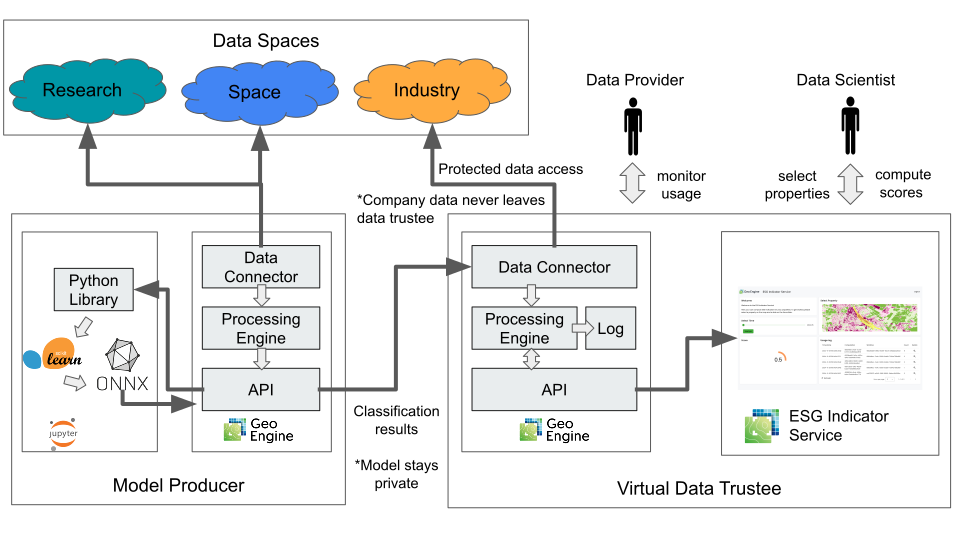
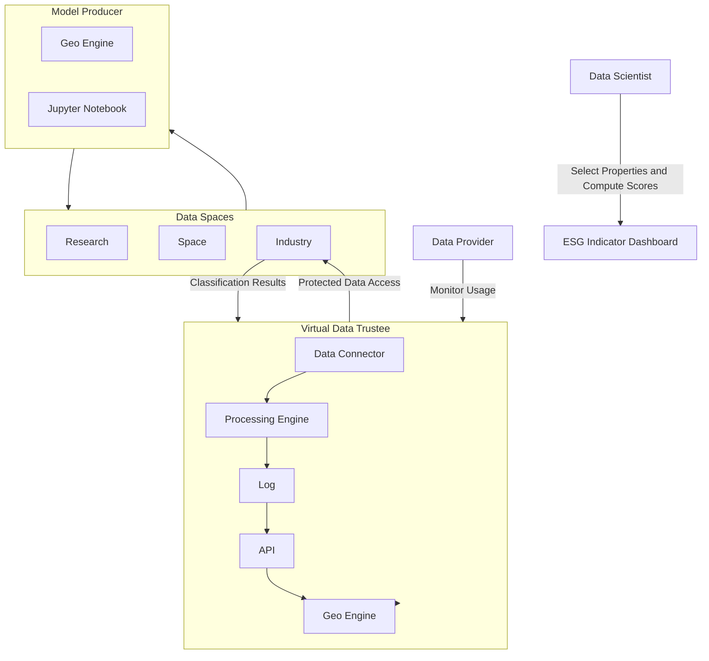

# FAIR-DS Demonstrator: Industry Data & ESG, Virtual Data Trustee

The ESG Indicator Serviceis a demonstrator for the FAIR-DS project.
This document presents the software architecture.
You can find more information about the app itself in the [FAIR-DS wiki](https://fair-ds4nfdi.github.io/wiki/).

## Architecture

There are four components to the ECOMETRICS app demonstrator: the Data Spaces, the Model Producer, the Virtual Data Trustee and the ESG Indicator Service Dashboard.
There are two kinds of users: a Data Provider that creates and supplies a machine learning model and a Data Scientist that uses the model to compute ESG scores on their own private company data.
The Virtual Data Trustee ensures that the model and the company data are kept separate and that the ESG scores are computed in a privacy-preserving way.
It also monitors the usage of the model and the data.
The following diagram shows the architecture of the ECOMETRICS app. 

### Data Spaces

The demonstrator uses three different Data Spaces: Research, Space, and Industry.
The Model producer uses the Research and Space Data Spaces to create a machine learning model.
The Virtual Data Trustee uses the Industry Data Space to access the company data.
Data Connectors allow the Geo Engine instances to access the data in the Data Spaces.

### Model Producer

The model producer runs a Geo Engine and a Jupyter notebook to build a machine learning pipeline.
The Jupyter Notebooks ingests the data from the Geo Engine, which in turn accesses the Data Spaces.
The model is trained and refined in the Jupyter notebook and then stored in the ONNX format.
It is registered as an operator in the Geo Engine.
The model producer's Geo Engine provides classification results to the Virtual Data Trustee such that the model does not have to be leaked to the user.

### Virtual Data Trustee

The Virtual Data Trustee ensures data sovereignty and privacy, and monitors usage.
It combines the classification from the model producer with the company data to compute ESG scores.
For this it accesses the Industry Data Space and computes a Geo Engine workflow.
The result are available via API which performs authentication and authorization to ensure that neither the model results nor the company data are leaked.
Access to the classification and company data are logged for monitoring purposes and could be used to bill the user for the service.

### ESG Indicator Service Dashboard

The ESG Indicator Service Dashboard is a custom web app build upon the Geo Engine UI toolkit.
It allows the user authenticate and browse the ESG and company data on an interactive map.
After selecting a property it allows the calculation of an ESG score, representing the predicted sustainability of the selected propertyFor a selected company property.
For this, it constructs a Geo Engine workflow and sends it to the Virtual Data Trustee API.
Additionaly, a usage log allows the user to monitor their usage of the ESG Indicator Service.

### Data Usage API

The Virtual Data Trustee's Geo Engine API allows data providers to monitor the usage of their data.
They can get a full log of all requests to the data and the classification results.
An aggregated view of the usage is also available.

## API documentation

The API of the ESG Indicator Service demo is documented via OpenAPI.
The [JSON File](https://esg-indicator-service.app.geoengine.io/api/api-docs/openapi.json) and [Swagger-UI](https://esg-indicator-service.app.geoengine.io/api/swagger-ui/) are available online.
